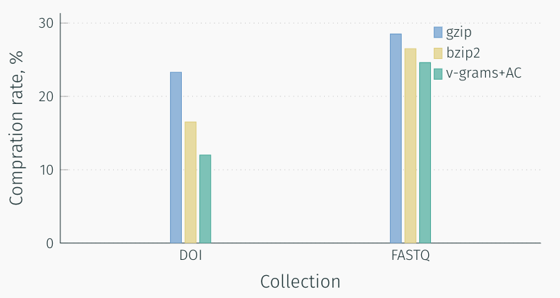
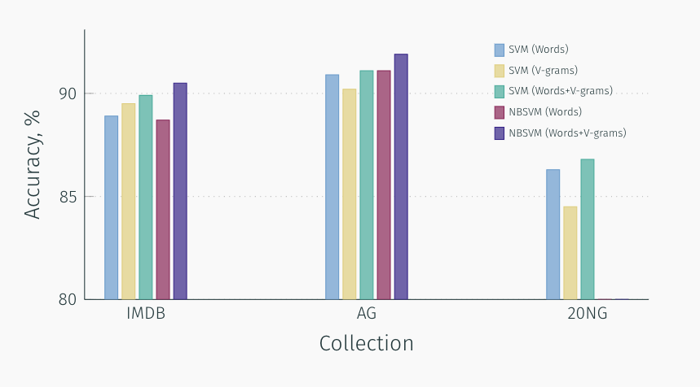
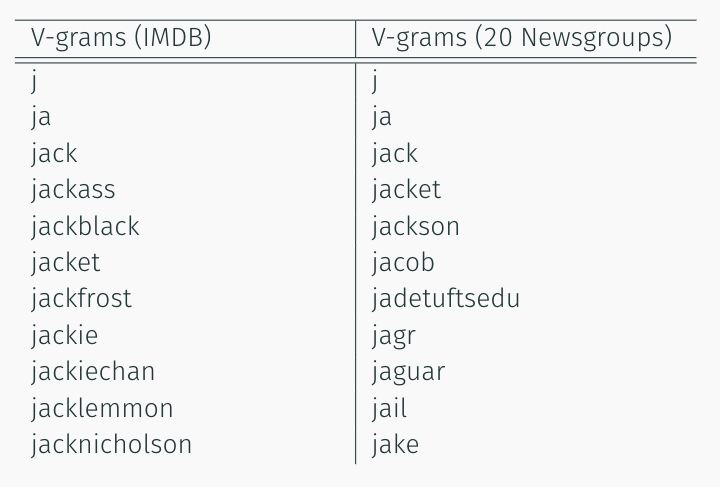

.. _about:

Use cases and theory
####################

Data compression
================

V-Grams dictionary building based on minimum description length principle.
This allows us to achieve competitive results in data compression tasks.
Comparison of v-gram algorithm with other popular compression algorithms on FASTQ and DOI URLs 2013 datasets has presented below.
We have used arithmetic coding (AC) as an entropy encoder.

Text classification
===================

Dictionary of v-grams may be used as words in bag-of-words text representation.
From the practical perspective, v-grams has at least two significant advantages over words:
straightforward text normalization and fixed dictionary volume.
V-gram dictionary can be much smaller than words dictionary but demonstrate the same score.
At IMDb dataset classification dictionary of only 5000 vgrams reach better score then 75000 words (15 times smaller).

In our experiments, we tested v-grams on three datasets: 20 News Groups, IMDb movie reviews, AG news.
Bag-of-words, bag-of-vgrams, and bag-of-(words&vgrams) was compared.
A text was normalized in the following way: all non-alphanumeric symbols were removed, then the text was converted to lower case.
Experiments show that even small vgram dictionary extract additional information and significantly increase the score.

Also, bag-of-words methods can be applied to non-textual data such as genome sequences or
text without words splitting like text in Asian or Arabic languages.

Sequences analysis
==================

V-Grams dictionary contains a lot of valuable information about the domain.
The following are examples of the resulting v-gram for two datasets: 20 newsgroups and IMDb movie database.

As you can see v-grams reflects the specifics of the data well.
Also, such analysis may be useful for more difficult to interpret data as genome sequences.
